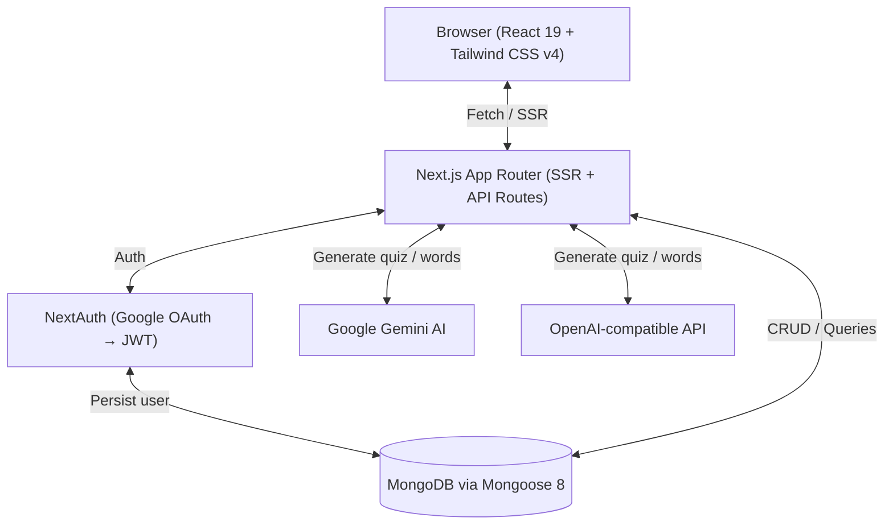
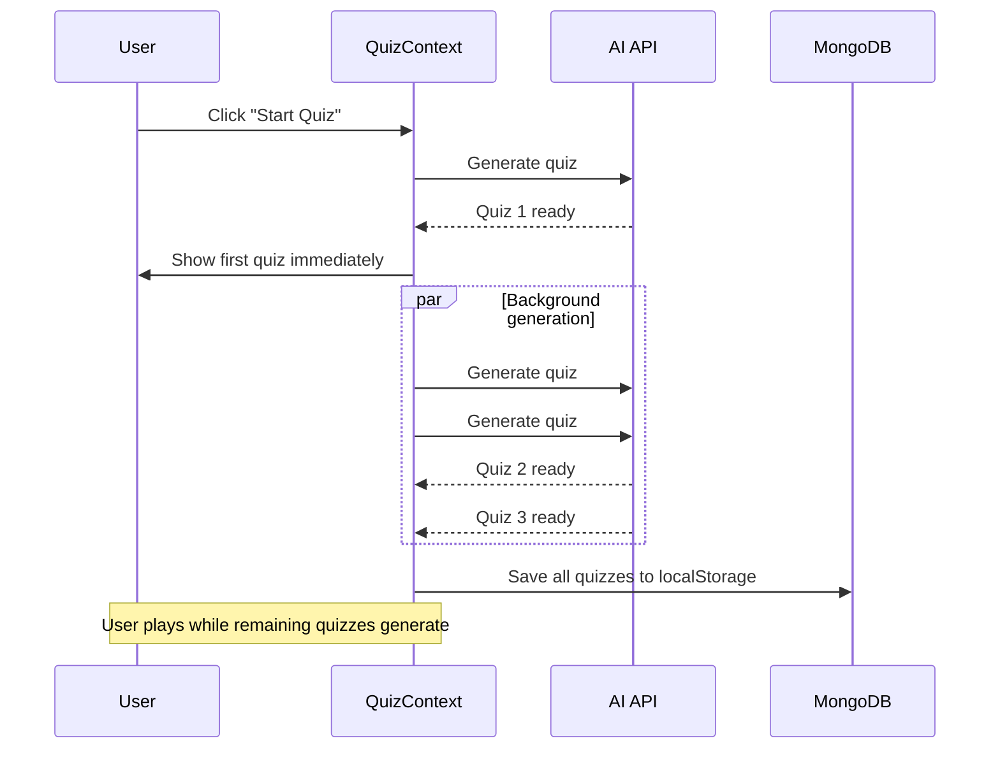

# 🌍 Lexiconx

**AI-powered vocabulary quiz app for language learning.** Save or generate words, then take AI-generated quizzes with spaced repetition, TTS audio, pinyin support, and level-based progression.

## 🌐 Supported Languages

| Learning                                 | UI Locales         |
| ---------------------------------------- | ------------------ |
| English, Deutsch, 中文, Español, русский | en, de, zh, es, ru |

---

## ✨ Features

- **AI-Generated Quizzes** — Google Gemini or OpenAI-compatible APIs create contextual multiple-choice questions from your vocabulary
- **Spaced Repetition (Modified SM-2)** — Words progress from New → Learning → Mastered based on `easeFactor`, `interval`, and `repetitions`
- **Smart Quiz Composition (Interleaving)** — Each quiz mixes ~30% new, ~40% learning, and ~30% mastered words for optimal retrieval practice
- **Elaborative Interrogation** — Every quiz question includes an `elaboration` (why the correct answer is right) and `errorExplanation` (why distractors are wrong), forcing deeper semantic processing
- **Memory Hooks (Keyword Method)** — A dedicated study mode generates phonetic keyword + bridge sentence mnemonics for your weakest words, presented as Anki-style flip cards
- **Progressive Quiz Generation** — First quiz appears instantly; 2 more generate in the background while you play
- **Level Progression** — 0–100 per language. Level up when `score.success / 2 > score.errors`; streaks tracked
- **Text-to-Speech** — Language-aware voice selection via EasySpeech
- **Pinyin Support** — Phonetic notation for Chinese words
- **5-Locale UI** — URL-based routing (`/en/quiz`, `/de/cards`) via next-intl
- **Dark / Light Theme** — System-aware theme toggle via next-themes
- **Google OAuth** — NextAuth JWT strategy with MongoDB user documents

---

## 🧠 Scientific Basis

Every learning feature in Lexiconx is grounded in peer-reviewed research from cognitive science and second-language acquisition (SLA). This section documents the theoretical foundations and how they map to the app's implementation.

### 1. Spaced Repetition — Modified SM-2 Algorithm

|                    |                                                                                                                                                                                                                                                                                                     |
| ------------------ | --------------------------------------------------------------------------------------------------------------------------------------------------------------------------------------------------------------------------------------------------------------------------------------------------- |
| **Theory**         | Hermann Ebbinghaus's Forgetting Curve (1885) demonstrated that memory decays exponentially unless reinforced at increasing intervals. Piotr Woźniak's SM-2 algorithm (1985) operationalized this into a practical scheduling system                                                                 |
| **Evidence**       | Spaced repetition produces **200–400% better long-term retention** compared to massed practice (Cepeda et al., 2006, _Psychological Bulletin_). Meta-analyses confirm robust effects across ages, domains, and retention intervals                                                                  |
| **Implementation** | Each `Word` document tracks `easeFactor` (minimum 1.3), `interval` (days), and `repetitions`. Correct answers increase the interval exponentially; incorrect answers reset repetitions to 0 and contract the interval. Words transition through three stages: **New** → **Learning** → **Mastered** |

### 2. Interleaved Practice — Smart Quiz Composition

|                    |                                                                                                                                                                                                                                                                      |
| ------------------ | -------------------------------------------------------------------------------------------------------------------------------------------------------------------------------------------------------------------------------------------------------------------- |
| **Theory**         | Interleaving different categories of items during practice forces discriminative contrast, strengthening category-level distinctions that blocked practice obscures (Rohrer et al., 2015, _Journal of Educational Psychology_)                                       |
| **Evidence**       | Interleaved practice yields **43% better long-term retention** compared to blocked practice for related items (Rohrer, 2012). The effect is strongest when categories share superficial similarities but differ in underlying rules                                  |
| **Implementation** | `/api/words-for-quiz` allocates ~30% new, ~40% learning, and ~30% mastered words per quiz. Words from each category are interleaved in round-robin rotation rather than presented in blocked groups, maximizing discriminative contrast between word maturity levels |

### 3. Elaborative Interrogation — Quiz Explanation Fields

|                    |                                                                                                                                                                                                                                                                                                                                                                             |
| ------------------ | --------------------------------------------------------------------------------------------------------------------------------------------------------------------------------------------------------------------------------------------------------------------------------------------------------------------------------------------------------------------------- |
| **Theory**         | Prompting learners to explain _why_ a fact is true forces deep semantic processing and integrates new information with existing knowledge, producing richer memory traces (Pressley et al., 1987; Dunlosky et al., 2013)                                                                                                                                                    |
| **Evidence**       | Rated as **high utility** by Dunlosky et al.'s (2013) comprehensive review of learning techniques. Produces **2–3× better retention** compared to re-reading, with effects replicated across age groups and knowledge domains                                                                                                                                               |
| **Implementation** | Every quiz question includes two required explanation fields: `elaboration` explains why the correct answer carries its meaning in context (etymology, word roots, cultural usage); `errorExplanation` explains why distractors are wrong (false cognates, wrong register, wrong collocation). These are generated by the AI and shown after each answer to deepen encoding |

### 4. Contextual Learning — i+1 Comprehensible Input

|                    |                                                                                                                                                                                                                                                                                                                               |
| ------------------ | ----------------------------------------------------------------------------------------------------------------------------------------------------------------------------------------------------------------------------------------------------------------------------------------------------------------------------- |
| **Theory**         | Krashen's Input Hypothesis (1982) posits that language acquisition occurs when learners receive comprehensible input at **i+1** — one step above their current competence. Context-embedded words are acquired faster than isolated lists because the surrounding sentence provides retrieval cues                            |
| **Evidence**       | Context-based vocabulary learning produces significantly better retention than decontextualized memorization (Webb, 2008, _Language Teaching Research_). The level-based complexity guidelines align with i+1: at each proficiency band, sentence length, grammar complexity, and question difficulty increase incrementally  |
| **Implementation** | Each quiz item embeds target words in a full sentence calibrated to the user's level (1–100). Sentence complexity progresses from 8–12 words at beginner levels to 30+ words at mastery. Question types evolve from factual ("What/Where") to inferential ("Why/How") to abstract analysis, keeping input consistently at i+1 |

### 5. Memory Hooks — Keyword Method Mnemonics

|                    |                                                                                                                                                                                                                                                                                                                                                                                                                                                                                                       |
| ------------------ | ----------------------------------------------------------------------------------------------------------------------------------------------------------------------------------------------------------------------------------------------------------------------------------------------------------------------------------------------------------------------------------------------------------------------------------------------------------------------------------------------------- |
| **Theory**         | The Keyword Method (Atkinson, 1975; Levin, 1992) creates a dual-link chain: an acoustic link connects the unfamiliar L2 word to a phonetically similar L1 keyword, and a bridge sentence connects the keyword to the target meaning. This exploits both the phonological loop and visual-imagery encoding                                                                                                                                                                                             |
| **Evidence**       | Large effect sizes (**d = 0.80–1.20**) for L2 vocabulary acquisition across experimental studies. The method is **especially effective for non-cognate languages** like Chinese, where no systematic sound-meaning overlap exists between L1 and L2 (Beaton et al., 1995)                                                                                                                                                                                                                             |
| **Implementation** | The `/memory-hooks` page selects the user's weakest words (lowest `easeFactor`). For each word, the LLM generates a `phoneticKeyword` (a native-language word that sounds like the target word) and a `bridgeSentence` (a vivid sentence linking the keyword to the meaning). These are stored as `MemoryHook` documents and presented as Anki-style flip cards: **front** shows the memory hook (keyword + bridge sentence), **back** reveals the word, definition, phonetic notation, and TTS audio |

### 6. Active Recall — Quiz Retrieval Practice

|                    |                                                                                                                                                                                                                                                                                                                     |
| ------------------ | ------------------------------------------------------------------------------------------------------------------------------------------------------------------------------------------------------------------------------------------------------------------------------------------------------------------- |
| **Theory**         | Retrieving information from memory strengthens the retrieval path itself, making future access more reliable. The testing effect shows that active recall is more effective than passive re-study even when the same content is reviewed (Roediger & Karpicke, 2006, _Psychological Science_)                       |
| **Evidence**       | Testing produces **50–100% better long-term retention** compared to re-study. The effect holds even when retrieval fails — incorrect guesses with corrective feedback still enhance subsequent learning (Kornell et al., 2009)                                                                                      |
| **Implementation** | The entire quiz system is built around forced-choice retrieval. Multiple-choice format ensures active engagement — the learner must evaluate each option against the sentence context. After answering, both `elaboration` and `errorExplanation` provide corrective feedback whether the answer was correct or not |

---

## 🛠 Tech Stack

| Technology        | Version | Purpose                                                  | Docs                                                                 |
| ----------------- | ------- | -------------------------------------------------------- | -------------------------------------------------------------------- |
| Next.js           | 15      | Full-stack React framework (App Router, SSR, API routes) | [docs](https://nextjs.org/docs)                                      |
| React             | 19      | UI library                                               | [docs](https://react.dev)                                            |
| TypeScript        | 5       | Type safety                                              | [docs](https://www.typescriptlang.org/docs)                          |
| Tailwind CSS      | 4       | Utility-first CSS                                        | [docs](https://tailwindcss.com/docs)                                 |
| MongoDB           | —       | NoSQL database                                           | [docs](https://www.mongodb.com/docs/)                                |
| Mongoose          | 8       | MongoDB ODM                                              | [docs](https://mongoosejs.com/docs/)                                 |
| Google Gemini AI  | —       | Quiz & word generation via `@google/genai`               | [docs](https://ai.google.dev/gemini-api/docs)                        |
| OpenAI-compatible | —       | Alternative AI provider via `openai` SDK                 | [docs](https://platform.openai.com/docs/api-reference)               |
| NextAuth.js       | 4       | Authentication (Google OAuth, JWT strategy)              | [docs](https://next-auth.js.org/getting-started/introduction)        |
| next-intl         | 4       | Internationalization (5 locales)                         | [docs](https://next-intl.dev/docs)                                   |
| next-themes       | 0.4     | Dark / light theme switching                             | [docs](https://github.com/pacocoursey/next-themes)                   |
| Framer Motion     | 12      | Animations                                               | [docs](https://www.framer.com/motion/)                               |
| EasySpeech        | 2       | Text-to-speech in browser                                | [docs](https://leaonline.github.io/easy-speech/)                     |
| Recharts          | 3       | Stats charts                                             | [docs](https://recharts.org/)                                        |
| canvas-confetti   | 1       | Celebrations on level up                                 | [docs](https://github.com/catdad/canvas-confetti)                    |
| Vitest            | 3       | Unit testing                                             | [docs](https://vitest.dev/)                                          |
| Testing Library   | 16      | React component testing                                  | [docs](https://testing-library.com/docs/react-testing-library/intro) |
| Husky             | 9       | Git hooks (pre-commit lint + test)                       | [docs](https://typicode.github.io/husky/)                            |
| pnpm              | —       | Package manager                                          | [docs](https://pnpm.io/)                                             |

---

## 🏗 Architecture



### Key Flows



- **Progressive Quiz Generation**: On button click, 1 quiz generates immediately (user starts playing), then 2 more generate in the background. localStorage is only saved after all quizzes are ready.
- **Spaced Repetition (Modified SM-2)**: Words have `easeFactor`, `interval`, `repetitions`. Correct answers increase interval; wrong answers reset. Words transition: New → Learning → Mastered.
- **Smart Quiz Composition (Interleaving)**: Words are allocated ~30% new, ~40% learning, ~30% mastered and interleaved in round-robin rotation for discriminative contrast.
- **Level Progression**: 0–100 per language. Level up if `score.success / 2 > score.errors`, else level down (min 0). Streaks tracked.
- **Authentication**: Google OAuth → NextAuth with JWT strategy → MongoDB user document. SSR auth guard via cookie forwarding.
- **i18n**: URL-based locale routing (`/en/cards`, `/de/quiz`). 5 locale JSON files.
- **TTS**: EasySpeech Observer singleton. Lazy initialization. Language-aware voice selection.
- **Theming**: System-aware dark/light toggle via `next-themes`. `ThemeProvider` wraps the app in `providers.tsx`; `ThemeSwitcher` component in Settings.

---

## 📦 Getting Started

### Prerequisites

- **Node.js** ≥ 18
- **pnpm** (install via `npm install -g pnpm`)
- **MongoDB** instance (local or Atlas)
- **Google OAuth** credentials ([Google Cloud Console](https://console.cloud.google.com/))
- **AI API key** — Google Gemini and/or an OpenAI-compatible provider

### Environment Variables

Copy `.env.example` to `.env.local` and fill in your values:

| Variable                   | Required | Purpose                                         |
| -------------------------- | -------- | ----------------------------------------------- |
| `MONGODB_URI`              | ✅       | MongoDB connection string                       |
| `NEXTAUTH_SECRET`          | ✅       | Secret for JWT encryption                       |
| `NEXTAUTH_URL`             | ✅       | Base URL of your app                            |
| `GOOGLE_CLIENT_ID`         | ✅       | Google OAuth client ID                          |
| `GOOGLE_CLIENT_SECRET`     | ✅       | Google OAuth client secret                      |
| `GEMINI_API_KEY`           | ✓        | Google Gemini API key (primary AI)              |
| `GEMINI_MODEL`             | —        | Gemini model name (default: `gemini-2.0-flash`) |
| `AI_PROVIDER_ENDPOINT`     | —        | OpenAI-compatible endpoint URL (fallback AI)    |
| `AI_PROVIDER_API_KEY`      | —        | API key for the OpenAI-compatible provider      |
| `AI_MODEL`                 | —        | Model name for the OpenAI-compatible provider   |
| `NEXT_PUBLIC_API_BASE_URL` | ✅       | Public base URL for client-side API calls       |

> When both Gemini and an OpenAI-compatible provider are configured, Gemini is primary and the other is used as a fallback (e.g. on rate limits).

### Installation

```bash
# Clone the repository
git clone https://github.com/gabrielmoris/lexiconx.git
cd lexiconx

# Install dependencies
pnpm install

# Copy environment variables
cp .env.example .env.local
# Edit .env.local with your actual values

# Start development server
pnpm dev
```

Open [localhost:3000](http://localhost:3000) in your browser.

---

## 🗄 Database Structure

### Users Collection

```javascript
{
email: String (required, unique),
googleID: String (unique),
name: String,
image: String,
nativeLanguage: String,
activeLanguage: String (default: "Chinese"),
learningProgress: [{
language: String (required),
level: Number (0-100, default: 0),
wordsMastered: Number (default: 0),
currentStreak: Number (default: 0),
lastSessionDate: Date,
timeSpent: Number (ms, default: 0)
}],
createdAt: Date,
updatedAt: Date
}
// Indexes: email (unique), googleID (unique)
```

### Words Collection

```javascript
{
userId: ObjectId (ref: 'User', indexed),
word: String (required),
definition: String (required),
phoneticNotation: String,
language: String (required),
tags: [String],
// SRS Fields
lastReviewed: Date,
nextReview: Date (default: now),
interval: Number (days, default: 0),
repetitions: Number (default: 0),
easeFactor: Number (default: 2.5, min 1.3),
createdAt: Date,
updatedAt: Date
}
// Indexes: { userId: 1, language: 1, nextReview: 1 }
```

### QuizSessions Collection

```javascript
{
userId: ObjectId (ref: 'User', indexed),
language: String (required),
date: Date (default: now),
totalQuestions: Number (required),
correctAnswers: Number (required),
wordsMastered: Number (default: 0),
duration: Number (ms, default: 0),
createdAt: Date,
updatedAt: Date
}
// Indexes: { userId: 1, language: 1, date: -1 }
```

### MemoryHooks Collection

```javascript
{
userId: ObjectId (ref: 'User', indexed),
wordId: ObjectId (ref: 'Word', unique compound with userId),
language: String (required),
phoneticKeyword: String (required), // e.g. "shoe" for 书 (shū)
bridgeSentence: String (required), // e.g. "Imagine a shoe on a book"
createdAt: Date,
updatedAt: Date
}
// Indexes: { userId: 1, wordId: 1 } (unique compound)
```

---

## 🔌 API Routes

| Method                    | Route                     | Purpose                                                |
| ------------------------- | ------------------------- | ------------------------------------------------------ |
| GET / POST / PUT / DELETE | `/api/words`              | CRUD for user vocabulary words                         |
| POST                      | `/api/words-for-quiz`     | Fetch overdue + new words with interleaved composition |
| POST                      | `/api/ai-quiz`            | Generate AI quiz from word pool                        |
| POST                      | `/api/ai-words`           | Generate AI vocabulary words                           |
| GET / POST                | `/api/memory-hooks`       | Fetch weak words with hooks / Generate hooks via AI    |
| GET / POST                | `/api/users`              | Get / create / update / delete user data & progress    |
| GET / POST                | `/api/stats`              | Analytics aggregations / save quiz session             |
| GET / POST                | `/api/auth/[...nextauth]` | NextAuth.js endpoints                                  |

---

## 📄 Pages

| Route                    | Purpose                                              |
| ------------------------ | ---------------------------------------------------- |
| `/[locale]`              | Home / landing                                       |
| `/[locale]/cards`        | Vocabulary card management                           |
| `/[locale]/quiz`         | Quiz gameplay                                        |
| `/[locale]/memory-hooks` | Flip card study mode for weak words (Keyword Method) |
| `/[locale]/stats`        | Learning analytics                                   |
| `/[locale]/settings`     | User settings                                        |
| `/[locale]/onboarding`   | New user setup                                       |
| `/[locale]/login`        | Authentication                                       |
| `/[locale]/terms`        | Terms of service                                     |
| `/[locale]/privacy`      | Privacy policy                                       |

---

## 📁 Project Structure

```
lexiconx/
├── components/ # React components
│ ├── AI/ # AiQuizzGenerator, AiGenerateVocabulary
│ ├── Auth/ # AuthProvider
│ ├── Icons/ # SVG icon components
│ ├── Layout/ # Header, Menu, LoadingComponent
│ │ └── Toast/ # Toast notification components
│ ├── MemoryHooks/ # MemoryHookCard (flip card), MemoryHooksDeck (deck + navigation)
│ ├── Onboarding/ # LocaleSwitcher, LanguageLearningOnboarding, AddFirstCards, OnboardingText
│ ├── Quiz/ # QuizView, QuizFinished
│ ├── Settings/ # NativeLanguage, LanguageToLearn, DeleteAccount, ThemeSwitcher
│ ├── Stats/ # OverviewCards, ReviewForecastChart, WordHealthChart, AccuracyTrendChart, WeakestWordsTable
│ ├── UI/ # Button, Popup
│ └── Words/ # WordCard, WordList, WordForm, ShowLearningFlag
├── context/ # React contexts
│ ├── QuizContext.tsx # Quiz state, progressive generation
│ ├── WordsContext.tsx # Vocabulary CRUD
│ ├── LanguageToLearnContext.tsx # Active language
│ └── ToastContext.tsx # Toast notifications
├── hooks/ # Custom hooks
│ ├── useQuizManager.tsx # Quiz gameplay logic & SRS
│ ├── useTextToSpeech.tsx # TTS integration
│ ├── useLocalStorage.tsx # Persistent state
│ ├── useConfetti.tsx # Celebration effects
│ ├── useGenerateWords.tsx # AI word generation
│ └── useAuthGuard.tsx # Auth guard
├── lib/ # Core libraries
│ ├── ai/ # AI client, prompts, generators
│ │ ├── generate-quiz.ts # Quiz generation with elaboration + error explanation
│ │ ├── generate-memory-hooks.ts # Keyword Method hook generation
│ │ ├── memory-hooks-prompts.ts # Keyword Method LLM prompt
│ │ ├── quiz-prompts.ts # Quiz LLM prompts (all 5 languages)
│ │ └── words-prompts.ts # Word generation LLM prompts
│ ├── auth/ # NextAuth config, SSR auth guard
│ ├── mongodb/ # Connection & models
│ │ └── models/ # word.ts, user.ts, quizSession.ts, memoryHook.ts
│ ├── tts/ # EasySpeech service
│ ├── apis.ts # API client functions
│ ├── correctionWords.ts # SRS algorithm
│ ├── helpers.ts # Shared utility functions
│ └── dateFormat.ts # Date formatting
├── messages/ # i18n JSON (en, de, zh, es, ru)
├── scripts/ # Utility & seed scripts
├── src/
│ ├── app/ # Next.js App Router
│ │ ├── api/ # API route handlers
│ │ └── [locale]/ # Locale-prefixed pages
│ ├── i18n/ # next-intl (request.ts, routing.ts, navigation.ts)
│ └── middleware.ts # Auth + locale middleware
├── types/ # TypeScript type definitions
│ ├── MemoryHook.ts # MemoryHook, MemoryHookCardData, MemoryHookGeneratorResponse
│ ├── Quiz.ts # Quiz, QuizQuestion, QuizAnswer, QuizComposition
│ └── Words.ts # Word, User, Language, Locale
└── public/ # Static assets
```

---

## 🔧 Scripts

| Command              | Description                  |
| -------------------- | ---------------------------- |
| `pnpm dev`           | Start dev server (Turbopack) |
| `pnpm build`         | Production build             |
| `pnpm start`         | Start production server      |
| `pnpm lint`          | Run ESLint                   |
| `pnpm test`          | Run Vitest once              |
| `pnpm test:watch`    | Run Vitest in watch mode     |
| `pnpm test:coverage` | Generate coverage report     |

### Pre-commit Hook

Husky runs `pnpm lint` and `pnpm test` on every commit. Tests must pass for the commit to succeed.

---

## 🤝 Contributing

1. **Fork** the repo
2. **Create a feature branch**: `git checkout -b feature/my-feature`
3. **Make changes**, add tests
4. **Ensure lint + tests pass**: `pnpm lint && pnpm test`
5. **Commit with conventional messages**: `feat:`, `fix:`, `docs:`, `test:`, `refactor:`
6. **Push** to your fork
7. **Open a Pull Request** against `master`

### Code Style

- TypeScript strict mode
- ESLint + Next.js config
- Tailwind utility classes (avoid inline styles)
- React functional components with hooks
- Preserve existing architecture unless proposing a change first
- Small, focused PRs preferred over broad rewrites
- Every task gets its own branch
- Never push directly to `master`
- Always add/update tests for new features

---

## 📄 License

Lexiconx is available under the GNU AGPLv3 for open-source use.

Commercial use without open-sourcing your modifications requires a separate commercial license. Contact [software@gabrielcmoris.com](mailto:software@gabrielcmoris.com).

This project is licensed under the terms found in the [LICENSE](./LICENSE) file.
