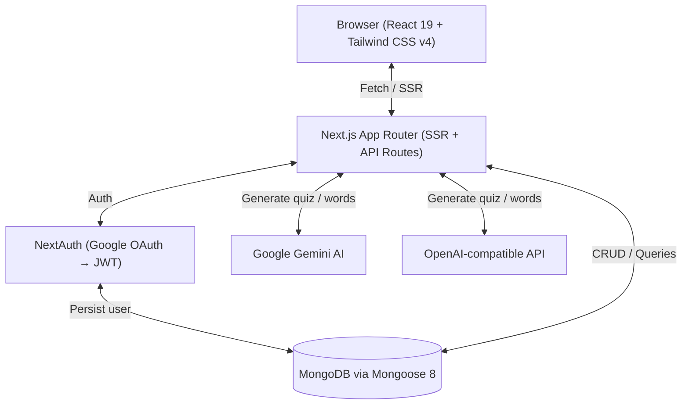
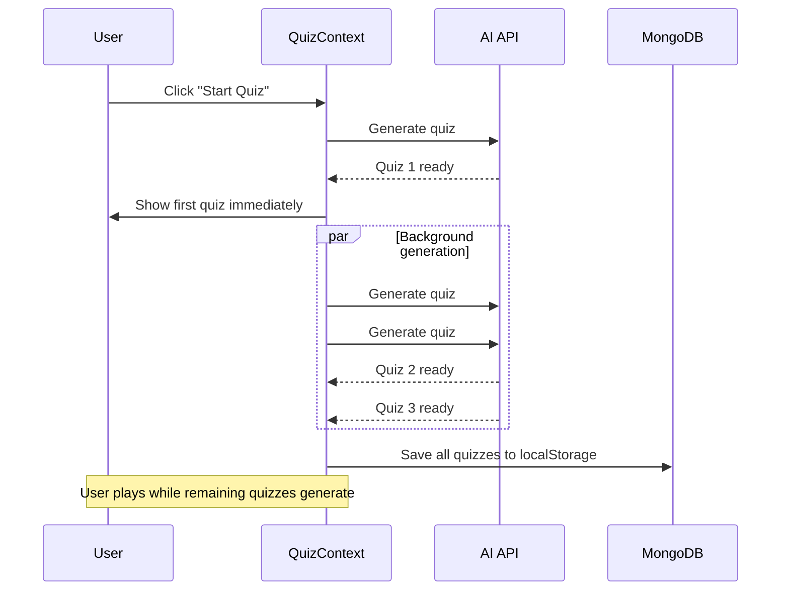

# 🌍 Lexiconx

**AI-powered vocabulary quiz app for language learning.** Save or generate words, then take AI-generated quizzes with spaced repetition, TTS audio, pinyin support, and level-based progression.

## 🌐 Supported Languages

| Learning | UI Locales |
|----------|------------|
| English, Deutsch, 中文, Español, русский | en, de, zh, es, ru |

---

## ✨ Features

- **AI-Generated Quizzes** — Google Gemini or OpenAI-compatible APIs create contextual multiple-choice questions from your vocabulary
- **Spaced Repetition (Modified SM-2)** — Words progress from New → Learning → Mastered based on `easeFactor`, `interval`, and `repetitions`
- **Progressive Quiz Generation** — First quiz appears instantly; 2 more generate in the background while you play
- **Level Progression** — 0–100 per language. Level up when `score.success / 2 > score.errors`; streaks tracked
- **Text-to-Speech** — Language-aware voice selection via EasySpeech
- **Pinyin Support** — Phonetic notation for Chinese words
- **5-Locale UI** — URL-based routing (`/en/quiz`, `/de/cards`) via next-intl
- **Google OAuth** — NextAuth JWT strategy with MongoDB user documents

---

## 🛠 Tech Stack

| Technology | Version | Purpose | Docs |
|---|---|---|---|
| Next.js | 15 | Full-stack React framework (App Router, SSR, API routes) | [docs](https://nextjs.org/docs) |
| React | 19 | UI library | [docs](https://react.dev) |
| TypeScript | 5 | Type safety | [docs](https://www.typescriptlang.org/docs) |
| Tailwind CSS | 4 | Utility-first CSS | [docs](https://tailwindcss.com/docs) |
| MongoDB | — | NoSQL database | [docs](https://www.mongodb.com/docs/) |
| Mongoose | 8 | MongoDB ODM | [docs](https://mongoosejs.com/docs/) |
| Google Gemini AI | — | Quiz & word generation via `@google/genai` | [docs](https://ai.google.dev/gemini-api/docs) |
| OpenAI-compatible | — | Alternative AI provider via `openai` SDK | [docs](https://platform.openai.com/docs/api-reference) |
| NextAuth.js | 4 | Authentication (Google OAuth, JWT strategy) | [docs](https://next-auth.js.org/getting-started/introduction) |
| next-intl | 4 | Internationalization (5 locales) | [docs](https://next-intl.dev/docs) |
| Framer Motion | 12 | Animations | [docs](https://www.framer.com/motion/) |
| EasySpeech | 2 | Text-to-speech in browser | [docs](https://github.com/nicholasgasior/easy-speech) |
| Recharts | 3 | Stats charts | [docs](https://recharts.org/) |
| canvas-confetti | 1 | Celebrations on level up | [docs](https://github.com/catdad/canvas-confetti) |
| Vitest | 3 | Unit testing | [docs](https://vitest.dev/) |
| Testing Library | 16 | React component testing | [docs](https://testing-library.com/docs/react-testing-library/intro) |
| Husky | 9 | Git hooks (pre-commit lint + test) | [docs](https://typicode.github.io/husky/) |
| pnpm | — | Package manager | [docs](https://pnpm.io/) |

---

## 🏗 Architecture



### Key Flows



- **Progressive Quiz Generation**: On button click, 1 quiz generates immediately (user starts playing), then 2 more generate in the background. localStorage is only saved after all quizzes are ready.
- **Spaced Repetition (Modified SM-2)**: Words have `easeFactor`, `interval`, `repetitions`. Correct answers increase interval; wrong answers reset. Words transition: New → Learning → Mastered.
- **Level Progression**: 0–100 per language. Level up if `score.success / 2 > score.errors`, else level down (min 0). Streaks tracked.
- **Authentication**: Google OAuth → NextAuth with JWT strategy → MongoDB user document. SSR auth guard via cookie forwarding.
- **i18n**: URL-based locale routing (`/en/cards`, `/de/quiz`). 5 locale JSON files.
- **TTS**: EasySpeech Observer singleton. Lazy initialization. Language-aware voice selection.

---

## 📦 Getting Started

### Prerequisites

- **Node.js** ≥ 18
- **pnpm** (install via `npm install -g pnpm`)
- **MongoDB** instance (local or Atlas)
- **Google OAuth** credentials ([Google Cloud Console](https://console.cloud.google.com/))
- **AI API key** — either Google Gemini or an OpenAI-compatible provider

### Installation

```bash
# Clone the repository
git clone https://github.com/gabrielmoris/lexiconx.git
cd lexiconx

# Install dependencies
pnpm install

# Copy environment variables
cp .env.example .env.local
# Edit .env.local with your actual values

# Start development server
pnpm dev
```

Open [localhost:3000](http://localhost:3000) in your browser.

---

## 🗄 Database Structure

### Users Collection

```javascript
{
 email: String (required, unique),
 googleID: String (unique),
 name: String,
 image: String,
 nativeLanguage: String,
 activeLanguage: String (default: "Chinese"),
 learningProgress: [{
 language: String (required),
 level: Number (0-100, default: 0),
 wordsMastered: Number (default: 0),
 currentStreak: Number (default: 0),
 lastSessionDate: Date,
 timeSpent: Number (ms, default: 0)
 }],
 createdAt: Date,
 updatedAt: Date
}
// Indexes: email (unique), googleID (unique)
```

### Words Collection

```javascript
{
 userId: ObjectId (ref: 'User', indexed),
 word: String (required),
 definition: String (required),
 phoneticNotation: String,
 language: String (required),
 tags: [String],
 // SRS Fields
 lastReviewed: Date,
 nextReview: Date (default: now),
 interval: Number (days, default: 0),
 repetitions: Number (default: 0),
 easeFactor: Number (default: 2.5, min 1.3),
 createdAt: Date,
 updatedAt: Date
}
// Indexes: { userId: 1, language: 1, nextReview: 1 }
```

### QuizSessions Collection

```javascript
{
 userId: ObjectId (ref: 'User', indexed),
 language: String (required),
 date: Date (default: now),
 totalQuestions: Number (required),
 correctAnswers: Number (required),
 wordsMastered: Number (default: 0),
 duration: Number (ms, default: 0),
 createdAt: Date,
 updatedAt: Date
}
// Indexes: { userId: 1, language: 1, date: -1 }
```

---

## 🔌 API Routes

| Method | Route | Purpose |
|---|---|---|
| GET / POST / PUT / DELETE | `/api/words` | CRUD for user vocabulary words |
| POST | `/api/words-for-quiz` | Fetch overdue + new words for quiz generation |
| POST | `/api/ai-quiz` | Generate AI quiz from word pool |
| POST | `/api/ai-words` | Generate AI vocabulary words |
| GET / PUT | `/api/users` | Get/update user data & learning progress |
| GET | `/api/stats` | Analytics aggregations |
| POST | `/api/stats` | Save quiz session |
| GET / POST | `/api/auth/[...nextauth]` | NextAuth.js endpoints |

---

## 📄 Pages

| Route | Purpose |
|---|---|
| `/[locale]` | Home / landing |
| `/[locale]/cards` | Vocabulary card management |
| `/[locale]/quiz` | Quiz gameplay |
| `/[locale]/stats` | Learning analytics |
| `/[locale]/settings` | User settings |
| `/[locale]/onboarding` | New user setup |
| `/[locale]/login` | Authentication |
| `/[locale]/terms` | Terms of service |
| `/[locale]/privacy` | Privacy policy |

---

## 📁 Project Structure

```
lexiconx/
├── components/          # React components
│   ├── AI/              # AI quiz & word generators
│   ├── Auth/            # Auth provider
│   ├── Icons/           # SVG icon components
│   ├── Layout/          # Header, Menu, Toast, Loading
│   ├── Onboarding/      # New user flow components
│   ├── Quiz/            # QuizView, QuizFinished
│   ├── Settings/        # User settings components
│   ├── Stats/           # Chart components
│   ├── UI/              # Button, Popup
│   └── Words/           # WordCard, WordList, WordForm
├── context/             # React contexts
│   ├── QuizContext.tsx           # Quiz state, progressive generation
│   ├── WordsContext.tsx          # Vocabulary CRUD
│   ├── LanguageToLearnContext.tsx # Active language
│   └── ToastContext.tsx          # Toast notifications
├── hooks/               # Custom hooks
│   ├── useQuizManager.tsx       # Quiz gameplay logic & SRS
│   ├── useTextToSpeech.tsx      # TTS integration
│   ├── useLocalStorage.tsx      # Persistent state
│   ├── useConfetti.tsx          # Celebration effects
│   ├── useGenerateWords.tsx     # AI word generation
│   └── useAuthGuard.tsx        # Auth guard
├── lib/                 # Core libraries
│   ├── ai/              # AI client, prompts, generators
│   ├── auth/            # NextAuth config, SSR auth guard
│   ├── mongodb/         # Connection & models
│   ├── tts/             # EasySpeech service
│   ├── apis.ts          # API client functions
│   ├── correctionWords.ts # SRS algorithm
│   └── dateFormat.ts    # Date formatting
├── messages/            # i18n JSON (en, de, zh, es, ru)
├── src/
│   ├── app/             # Next.js App Router
│   │   ├── api/         # API route handlers
│   │   └── [locale]/    # Locale-prefixed pages
│   ├── i18n/            # next-intl config
│   ├── middleware.ts    # Auth + locale middleware
│   └── providers.tsx    # Client providers wrapper
├── types/               # TypeScript type definitions
└── docs/                # Project documentation
```

---

## 🔧 Scripts

| Command | Description |
|---|---|
| `pnpm dev` | Start dev server (Turbopack) |
| `pnpm build` | Production build |
| `pnpm start` | Start production server |
| `pnpm lint` | Run ESLint |
| `pnpm test` | Run Vitest once |
| `pnpm test:watch` | Run Vitest in watch mode |
| `pnpm test:coverage` | Generate coverage report |

### Pre-commit Hook

Husky runs `pnpm lint` and `pnpm test` on every commit. Tests must pass for the commit to succeed.

---

## 🤝 Contributing

1. **Fork** the repo
2. **Create a feature branch**: `git checkout -b feature/my-feature`
3. **Make changes**, add tests
4. **Ensure lint + tests pass**: `pnpm lint && pnpm test`
5. **Commit with conventional messages**: `feat:`, `fix:`, `docs:`, `test:`, `refactor:`
6. **Push** to your fork
7. **Open a Pull Request** against `master`

### Code Style

- TypeScript strict mode
- ESLint + Next.js config
- Tailwind utility classes (avoid inline styles)
- React functional components with hooks
- Preserve existing architecture unless proposing a change first
- Small, focused PRs preferred over broad rewrites
- Every task gets its own branch
- Never push directly to `master`
- Always add/update tests for new features

---

## 📄 License

This project is licensed under the terms found in the [LICENSE](./LICENSE) file.
